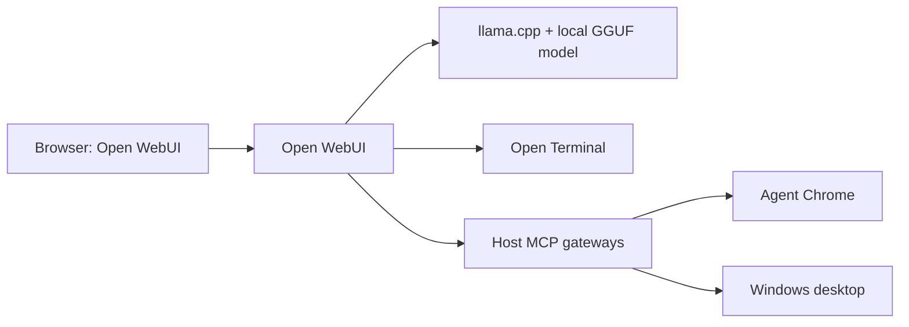

# Local AI Agent & Vision Stack для Windows

Готовый Windows-first стек для локального запуска совместимых с
`llama.cpp` GGUF-моделей с Open WebUI, Vision и агентными инструментами.
Всё inference работает локально через CUDA-контейнер `llama.cpp`; Open WebUI
получает OpenAI-совместимый API, терминал, отдельный Agent Chrome и управление
рабочим столом Windows.

По умолчанию подключена
[Qwen3.8-27B-GGUF от Unsloth](https://huggingface.co/unsloth/Qwen3.8-27B-GGUF)
в квантовании Q4_K_M и с совместимым F16 vision-projector. Это только
проверенный default: модель не зашита в архитектуру проекта и заменяется
через переменные `MODEL_*` в `.env`. Для Vision-модели основной GGUF и
`mmproj` должны относиться к одной модели и ревизии.

Дефолтная Qwen3.8 имеет лицензию Apache-2.0, thinking, MTP и нативный
контекст до 262 144 токенов. Публичный профиль начинает с окна
32 768 токенов и рассчитан на GPU с 16 GB VRAM; профиль для 32 GB VRAM
приведён ниже.

> [!IMPORTANT]
> Этот репозиторий рассчитан на Windows 10/11 и Docker Desktop с
> Linux-контейнерами. Host-инструменты Chrome и Computer не будут
> работать при запуске только на Linux, macOS или внутри WSL.

## Состав стека

| Компонент | Где работает | Назначение |
|---|---|---|
| `llm-server` | Docker + NVIDIA CUDA | Text/Vision inference через `llama.cpp` |
| Open WebUI | Docker | Чат, файлы, reasoning selector и агентные инструменты |
| Open Terminal | Docker | Терминал с рабочей папкой из `PROJECTS_DIR` |
| Agent Chrome | Windows | Изолированный постоянный профиль Chrome |
| Chrome DevTools MCP | Windows | Управление всеми вкладками Agent Chrome |
| Computer MCP | Windows | Экран, мышь, клавиатура, приложения и файловые операции |



LLM API и Open Terminal доступны только во внутренней сети Compose. На Windows
публикуется только Open WebUI на `127.0.0.1:${WEBUI_PORT}`. MCP и DevTools-порты
также принудительно привязаны к `127.0.0.1`.

## Требования

- Windows 10/11 x64 и PowerShell 5.1 или новее;
- Docker Desktop в режиме Linux-контейнеров с доступом к NVIDIA GPU;
- актуальный NVIDIA Driver;
- Node.js 22 LTS и npm (minimum — Node.js 20.19; Node.js 18 не поддерживается
  закреплённым `chrome-devtools-mcp`);
- Google Chrome Stable;
- не менее 35 GB свободного места: около 18 GB занимают GGUF и
  projector, остальное нужно Docker-образам и данным WebUI;
- рекомендуется NVIDIA GPU с 16 GB VRAM и не менее 32 GB системной RAM;
  48 GB RAM дают больший запас при частичном GPU-offload.

Дефолтный Q4_K_M вместе с projector и рабочими буферами не помещается
в 16 GB VRAM целиком. `MODEL_GPU_LAYERS=auto` автоматически оставляет часть слоёв
в системной RAM, поэтому скорость будет ниже, чем при полном offload. Для профиля
192K рекомендуется 32 GB VRAM и 64 GB RAM или больше.

## Быстрый запуск

Клонируйте репозиторий или скачайте ZIP, затем откройте PowerShell или
`cmd.exe` в его корне — рядом с `compose.yaml` — и выполните:

```powershell
.\start.cmd
```

Первый запуск автоматически:

1. создаёт локальный `.env` из `.env.example`;
2. генерирует уникальные `WEBUI_SECRET_KEY` и `OPEN_TERMINAL_API_KEY`;
3. проверяет Docker Desktop и конфигурацию;
4. скачивает основной GGUF и vision-projector с возможностью продолжить загрузку;
5. сверяет SHA-256 обоих файлов;
6. устанавливает закреплённые npm-зависимости MCP-host;
7. запускает Agent Chrome, Chrome DevTools MCP и Computer MCP;
8. запускает `llm-server`, Open WebUI и Open Terminal;
9. ждёт health-check всех контейнеров;
10. устанавливает в Open WebUI модель и фильтр Reasoning Effort.

Первый запуск может занять много времени: скачивается около 18 GB
модельных файлов и несколько Docker-образов. Прерванная загрузка GGUF
продолжится при следующем `start.cmd`.

После запуска откройте <http://localhost:3000> или порт, заданный в
`WEBUI_PORT`. При стандартном
`WEBUI_AUTH=true` первый зарегистрированный пользователь становится локальным
администратором.

В выборе модели используйте имя из `MODEL_DISPLAY_NAME`: в дефолтном
профиле это **Qwen3.8 27B Q4_K_M Vision**. Проект заранее привязывает к этой модели **Chrome**,
**Computer**, **Projects Terminal** и **Reasoning Effort**, поэтому в новых чатах
они активны автоматически. У необработанной base-модели с тем же API ID
этих привязок может не быть.

Остановка всех контейнеров, Agent Chrome и host MCP:

```powershell
.\stop.cmd
```

`stop.cmd` не удаляет модели, авторизации Agent Chrome, чаты и настройки
Open WebUI. Повторный `start.cmd` их использует заново. Если Docker Desktop
уже выключен и `stop.cmd` не может выполнить `docker compose down`, host-
процессы можно остановить отдельно:

```powershell
powershell.exe -NoProfile -ExecutionPolicy Bypass -File .\scripts\Stop-McpHost.ps1
```

## Конфигурация `.env`

Не редактируйте `.env.example` для личной машины. Меняйте созданный `.env`: он
исключён из Git и может содержать локальные пути, ключи и выбранную модель.
Записывайте значения как `NAME=value`, без кавычек вокруг значения.
Обновление `.env.example` не перезаписывает уже существующий `.env`: новые
defaults применяются к свежим клонам, а текущие установки сохраняют выбранный
пользователем профиль.

### Docker и порты

| Переменная | Default | Описание |
|---|---:|---|
| `COMPOSE_PROJECT_NAME` | `local-ai` | Имя Compose-проекта и префикс контейнеров |
| `WEBUI_DATA_VOLUME` | `local-ai-open-webui-data` | Именованный volume с данными Open WebUI |
| `WEBUI_PORT` | `3000` | Порт Open WebUI на `127.0.0.1` Windows |
| `LLM_SERVER_PORT` | `8080` | Внутренний порт `llm-server`; на host не публикуется |
| `LLAMA_CPP_IMAGE` | закреплённый digest | Проверенная CUDA-сборка `llama.cpp` |
| `OPEN_WEBUI_IMAGE` | закреплённый digest | Проверенная версия Open WebUI 0.11.0 |
| `OPEN_TERMINAL_IMAGE` | закреплённый digest | Проверенная версия Open Terminal 0.11.35 |

Внутренние порты Open WebUI `8080` и Open Terminal `8000` являются контрактом
соответствующих образов и не публикуются на Windows. Настраиваемый порт LLM
вынесен в `LLM_SERVER_PORT` и используется одновременно сервером, health-check и
Open WebUI connection URL.

### Модель

Все значения ниже — дефолтный профиль Qwen3.8, а не обязательные имена
для самого стека. Для замены модели обновите её API ID, отображаемое имя,
имена файлов, URL и SHA-256. Набор параметров запуска должен поддерживаться
выбранной моделью и закреплённым образом `llama.cpp`.

| Переменная | Default | Описание |
|---|---|---|
| `MODEL_API_ID` | `local/qwen3.8-27b:q4_k_m` | ID модели в API и Open WebUI |
| `MODEL_DISPLAY_NAME` | `Qwen3.8 27B Q4_K_M Vision` | Видимое название |
| `MODEL_GGUF_FILE` | `Qwen3.8-27B-Q4_K_M.gguf` | Локальное имя основного GGUF |
| `MODEL_GGUF_URL` | Unsloth Hugging Face | Точный URL основного GGUF |
| `MODEL_GGUF_SHA256` | проверенная сумма | Контроль целостности основного GGUF |
| `MODEL_MMPROJ_FILE` | `mmproj-F16.gguf` | Локальное имя vision-projector |
| `MODEL_MMPROJ_URL` | Unsloth Hugging Face | Точный URL projector |
| `MODEL_MMPROJ_SHA256` | проверенная сумма | Контроль целостности projector |
| `MODEL_CONTEXT_SIZE` | `32768` | Общее контекстное окно одного inference-слота |
| `MODEL_PARALLEL` | `1` | Число параллельных слотов |
| `MODEL_GPU_LAYERS` | `auto` | `auto`, `all` или точное число слоёв на GPU |
| `MODEL_KV_CACHE_TYPE` | `q4_0` | Тип K/V-кэша; Q4 экономит VRAM, Q8 точнее |
| `MODEL_IMAGE_MIN_TOKENS` | `1024` | Минимальный бюджет токенов изображения для Qwen-VL |
| `MODEL_SPECULATIVE_TYPE` | `none` | MTP отключён в профиле 16 GB для экономии памяти |
| `MODEL_SPECULATIVE_TOKENS` | `0` | Максимальное число MTP draft-токенов |

Файлы загружаются в `.model-cache`, проверяются по SHA-256 и монтируются в
контейнер только для чтения. Частичная загрузка сохраняется с расширением
`.partial` и продолжается при следующем `start.cmd`.

Для другой Vision GGUF-модели необходимо заменить одновременно основной GGUF и
совместимый с ним `mmproj`. Projector от другой модели или ревизии использовать
нельзя. Если выбранная модель поддерживает MTP и есть запас VRAM, его можно
включить:

```dotenv
MODEL_SPECULATIVE_TYPE=draft-mtp
MODEL_SPECULATIVE_TOKENS=2
```

### Open WebUI и сжатие контекста

| Переменная | Default | Описание |
|---|---:|---|
| `WEBUI_AUTH` | `true` | Локальная регистрация и вход в Open WebUI |
| `WEBUI_SECRET_KEY` | генерируется | Секрет сессий Open WebUI |
| `OPEN_TERMINAL_API_KEY` | генерируется | Bearer key между WebUI и Terminal |
| `CONTEXT_COMPACTION_ENABLED` | `true` | Автоматическое сжатие длинного чата |
| `CONTEXT_COMPACTION_TOKEN_THRESHOLD` | `16000` | Когда начинать сжатие |
| `CONTEXT_COMPACTION_TOKEN_CAP` | `16000` | Максимальный объём до summary |
| `CONTEXT_COMPACTION_RETENTION_PERCENTAGE` | `25` | Доля последних сообщений, сохраняемая дословно; допустимо 10–50 |

Не публикуйте `.env`. Если секреты когда-либо попали в Git или публичный лог,
замените их новыми случайными строками длиной не менее 32 символов.

### Agent Chrome, Computer и проекты

| Переменная | Default | Описание |
|---|---:|---|
| `COMPUTER_USE_MCP_PORT` | `8932` | Loopback-порт Computer MCP |
| `CHROME_DEVTOOLS_MCP_PORT` | `8933` | Loopback-порт Chrome DevTools MCP |
| `AGENT_CHROME_DEBUG_PORT` | `9333` | Loopback-порт DevTools Agent Chrome |
| `CHROME_EXECUTABLE` | пусто | Необязательный абсолютный путь к `chrome.exe` |
| `PROJECTS_DIR` | `./projects` | Windows-папка, смонтированная в Open Terminal |
| `COMPUTER_USE_FS_ROOTS` | пусто | Allowlist абсолютных корней для файлового инструмента Computer |
| `COMPUTER_USE_DESTRUCTIVE_REQUIRES_APPROVAL` | `true` | Подтверждение разрушительных файловых операций |

Все host-порты должны быть целыми числами от 1 до 65535 и не должны совпадать.
Startup-скрипт проверяет это до запуска контейнеров.

По умолчанию проекты располагаются рядом с Compose:

```dotenv
PROJECTS_DIR=./projects
```

Можно задать индивидуальный абсолютный путь Windows:

```dotenv
PROJECTS_DIR=D:/Work/Projects
```

В Open Terminal эта папка всегда видна как `/home/user/workspace`, независимо от
буквы диска и имени пользователя на Windows.

## Профили GPU и контекста

### Переносимый default для 16 GB VRAM

```dotenv
MODEL_CONTEXT_SIZE=32768
MODEL_GPU_LAYERS=auto
MODEL_KV_CACHE_TYPE=q4_0
MODEL_SPECULATIVE_TYPE=none
MODEL_SPECULATIVE_TOKENS=0
CONTEXT_COMPACTION_TOKEN_THRESHOLD=16000
CONTEXT_COMPACTION_TOKEN_CAP=16000
```

### Высококачественный профиль для 32 GB VRAM

```dotenv
MODEL_API_ID=local/qwen3.8-27b:q5_k_m
MODEL_DISPLAY_NAME=Qwen3.8 27B Q5_K_M Vision
MODEL_GGUF_FILE=Qwen3.8-27B-Q5_K_M.gguf
MODEL_GGUF_URL=https://huggingface.co/unsloth/Qwen3.8-27B-GGUF/resolve/main/Qwen3.8-27B-Q5_K_M.gguf?download=true
MODEL_GGUF_SHA256=07deb7fa91bf751d3000774fe5bb8afae5ffb41255fd19980147468052e07177
MODEL_CONTEXT_SIZE=196608
MODEL_GPU_LAYERS=all
MODEL_KV_CACHE_TYPE=q8_0
MODEL_SPECULATIVE_TYPE=draft-mtp
MODEL_SPECULATIVE_TOKENS=2
CONTEXT_COMPACTION_TOKEN_THRESHOLD=75000
CONTEXT_COMPACTION_TOKEN_CAP=75000
```

После изменения параметров выполните `start.cmd`: Compose пересоздаст только
изменившиеся контейнеры. Чем больше окно и точность KV, тем выше расход VRAM и
дольше prefill больших чатов.

## Vision и Reasoning Effort

Vision включается автоматически, потому что дефолтный профиль всегда запускает
совместимые `MODEL_GGUF_FILE` и `MODEL_MMPROJ_FILE`. Проверочный запрос:

```text
Проанализируй приложенное изображение. Перечисли весь видимый текст, элементы интерфейса и возможные ошибки.
```

Проект устанавливает toggleable Filter **Reasoning Effort**. В меню интеграций
чата откройте его настройки и выберите `Low`, `Medium` или `XHigh`. Значение
передаётся в `reasoning_effort` каждого запроса. Thinking у стандартной Qwen3.8
включён по умолчанию; MTP ускоряет генерацию и не заменяет reasoning.

## Agent Chrome

`start.cmd` запускает отдельный профиль Chrome с параметрами:

```text
--remote-debugging-port=<AGENT_CHROME_DEBUG_PORT>
--remote-debugging-address=127.0.0.1
--user-data-dir=<project>\.runtime\agent-chrome-profile
```

Профиль сохраняет cookies и авторизации между запусками, но отделён от обычного
профиля Chrome. Инструмент **Chrome** видит все вкладки только Agent Chrome.
Расширение Playwright и ручное подтверждение удалённой отладки не требуются.

Проверка в чате:

```text
Используй инструмент Chrome. Покажи заголовки и адреса всех открытых вкладок, ничего не изменяй.
```

Если Chrome установлен нестандартно, задайте:

```dotenv
CHROME_EXECUTABLE=D:\Apps\Chrome\Application\chrome.exe
```

## Computer и файловый allowlist

Безопасная проверка только на чтение:

```text
Используй только Computer. Сделай снимок текущего рабочего стола, определи активное окно и перечисли видимые приложения. Ничего не нажимай.
```

`COMPUTER_USE_FS_ROOTS` ограничивает только встроенный файловый инструмент
Computer. Пустое значение автоматически разрешает абсолютный путь
`PROJECTS_DIR`. Несколько корней перечисляются через запятую:

```dotenv
COMPUTER_USE_FS_ROOTS=D:\Work,E:\Shared
```

Open Terminal и этот allowlist независимы: Terminal видит только
`PROJECTS_DIR`. Управление экраном, мышью и приложениями не ограничивается
файловым allowlist, поэтому Computer следует включать только для доверенных
локальных пользователей.

## Почему используется контейнер `llama.cpp`

Docker Model Runner не требуется. Официальный CUDA-образ `llama.cpp` подключает
основной GGUF и `mmproj` напрямую и предоставляет OpenAI-compatible endpoint.
Это также обходит наблюдавшуюся в Docker Model Runner 1.2.6 на Windows ошибку
упаковки projector `missing blob`. LLM endpoint не публикуется на host, поэтому
доступ к нему имеет только внутренняя сеть Compose.

## Диагностика

Состояние:

```powershell
docker compose ps
```

Журналы:

```powershell
docker compose logs --tail 100 llm-server
docker compose logs --tail 100 open-webui
docker compose logs --tail 100 open-terminal
Get-Content .\logs\chrome-devtools-mcp.error.log -Tail 100
Get-Content .\logs\computer-use-mcp.error.log -Tail 100
```

GPU:

```powershell
nvidia-smi
```

Проверка итогового Compose без запуска:

```powershell
docker compose config --quiet
```

Если модель не помещается в VRAM, сначала уменьшите `MODEL_CONTEXT_SIZE`, затем
переключите `MODEL_KV_CACHE_TYPE=q4_0` и оставьте `MODEL_GPU_LAYERS=auto`.

### В чате нет Chrome, Computer или Terminal

1. Создайте новый чат и выберите именно модель из `MODEL_DISPLAY_NAME`.
2. Повторно выполните `start.cmd`: bootstrap безопасно повторит привязку.
3. Проверьте MCP-логи и убедитесь, что порты из `.env` не заняты другими
   процессами.

### `Context size has been exceeded`

Начните новый чат или вручную вызовите Compact. Для постоянного решения
убедитесь, что `CONTEXT_COMPACTION_TOKEN_THRESHOLD` заметно меньше
`MODEL_CONTEXT_SIZE`: нужен запас для system prompt, схем инструментов,
изображений, reasoning и ответа модели.

## Ограничения

- Проект не настраивает безопасный удалённый доступ; все host-интерфейсы
  намеренно доступны только локально.
- Computer и Chrome работают на Windows host и не являются Docker-контейнерами.
- Видеовход модели не настроен; `mmproj` и Open WebUI в этом проекте
  проверены для одиночных изображений.
- Качество tool calling зависит от модели и длины контекста; даже при
  корректной конфигурации локальная 27B-модель может ошибаться.

## Обновление образов

Образы закреплены digest-значениями, чтобы новый clone через месяц запускал тот
же проверенный набор компонентов. Для обновления измените соответствующую
переменную `*_IMAGE` в `.env.example`, выполните полный smoke-test и только затем
фиксируйте новый digest в Git.

## Безопасность и публикация

- `.env`, `.model-cache`, `.runtime`, `logs`, `projects` и `node_modules`
  исключены из Git;
- WebUI и все host MCP слушают только `127.0.0.1`;
- LLM и Open Terminal вообще не публикуют host-порты;
- не отключайте `WEBUI_AUTH` на компьютере с недоверенными пользователями;
- не давайте Computer доступ к дискам и приложениям, которые модель не должна
  видеть;
- код, скрипты и документация этого репозитория открыты под Apache License 2.0;
- лицензия Apache-2.0 модели Qwen не автоматически лицензирует код этого
  репозитория.

Папка изначально может не быть Git-репозиторием. Перед первым push полезно
проверить состав индекса:

```powershell
git init
git add .
git status --short
git status --ignored --short
git diff --cached --check
git check-ignore -v .env .model-cache .runtime logs projects
```

В staged-файлах не должно быть `.env`, GGUF, профиля Agent Chrome, логов,
пользовательских проектов и `mcp-host/node_modules`. В Git должны попасть
`.env.example`, `package-lock.json`, PowerShell/CMD-скрипты, `compose.yaml` и папка
`open-webui`.

## Лицензии

- Код, скрипты и документация этого репозитория лицензированы под
  [Apache License 2.0](LICENSE).
- Веса Qwen3.8 распространяются отдельно под Apache-2.0 и не хранятся в
  этом Git-репозитории.
- Docker-образы и npm-зависимости остаются под своими upstream-лицензиями.
